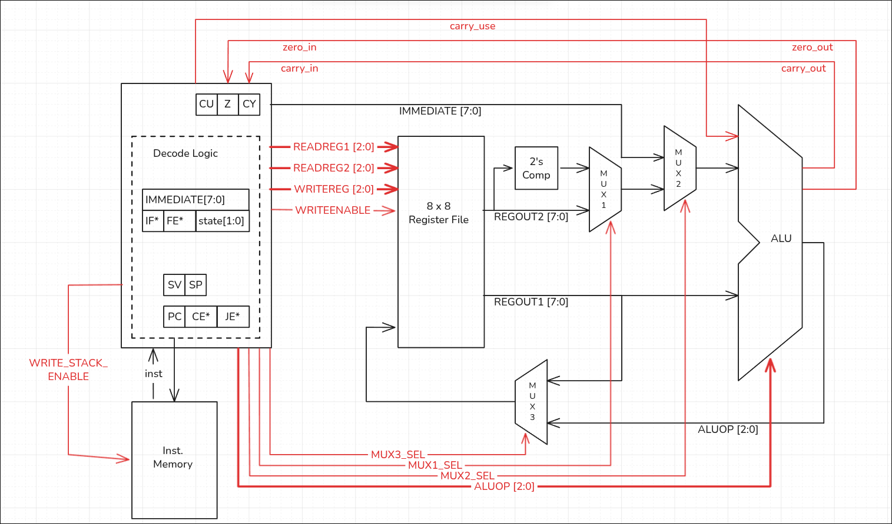
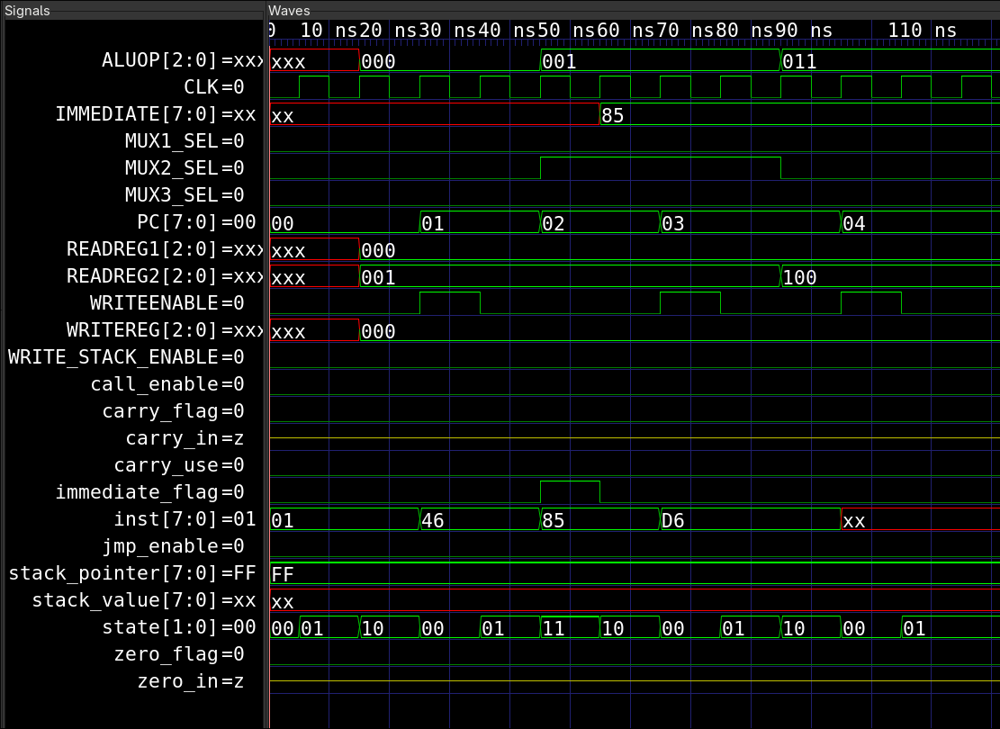
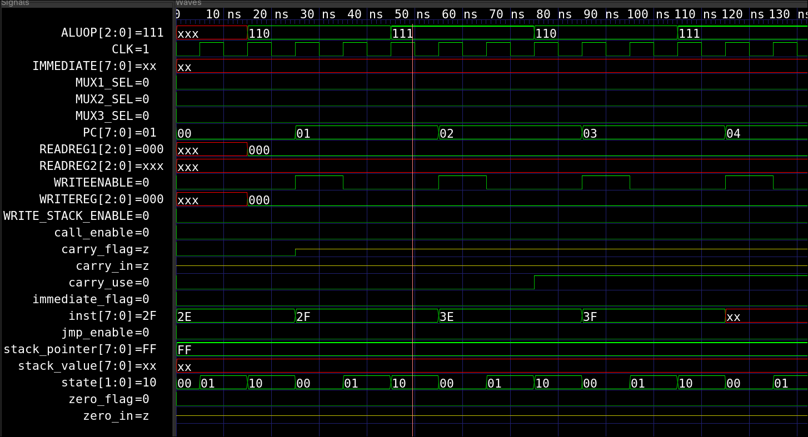
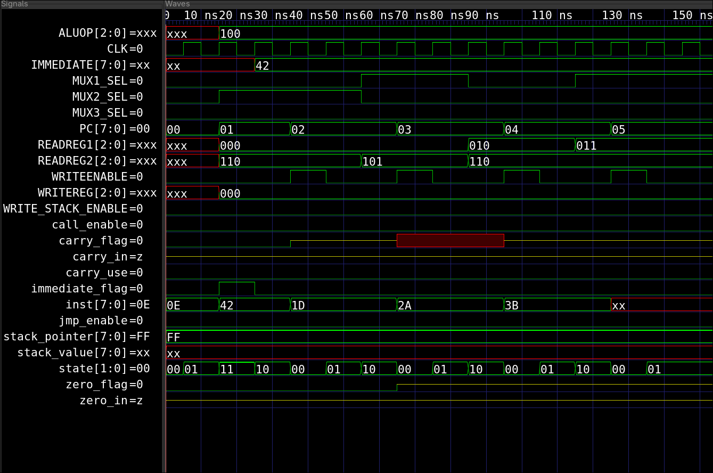
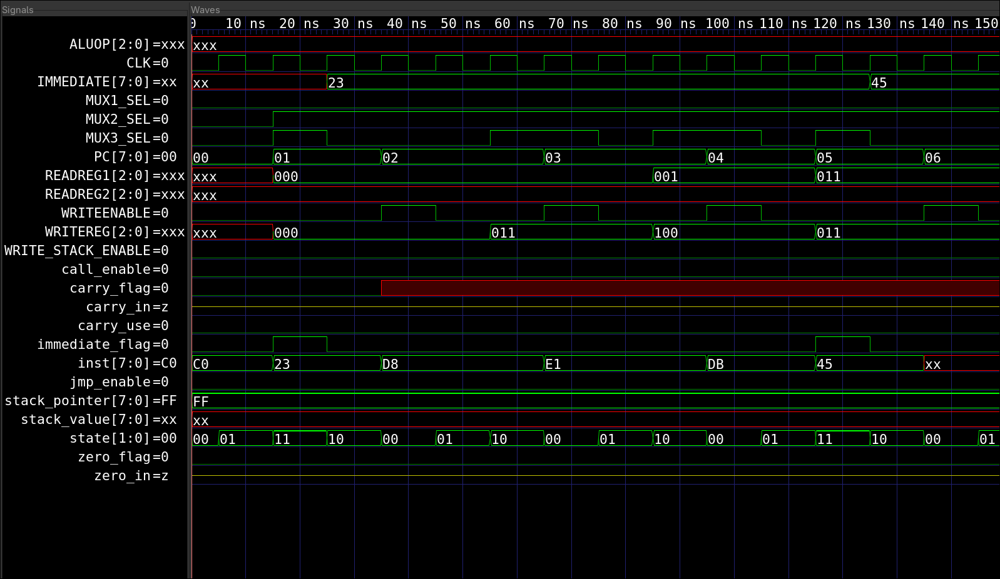
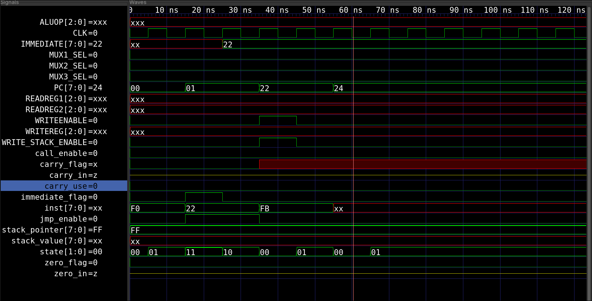

# FPGA Lab Session:
## Assignment 2:
### Implement Control Unit for 8 bit CPU
---

#### Table of Contents
1. [Introduction to the Repo](#introduction)
2. [Lab Intro](#introduction-to-lab-session)
3. [Coding Environment](#environment)
4. [Usage and Output](#usage)

---

### Introduction
This repository serves as the assignment submission for Elective Classes on FPGA course for:
| Name  | Arun Pankaj Bhatta |
| -------------- | --------------- |
| Roll no. | 079BEI008 |

During the session of Lab-2, we were brainstorming ideas for implementation of the CPU for 8-bit architecture, as presented below in the figure provided by the lab instructor:

After the lab session, we were tasked to complete only the control unit for the CPU with the following title of assignment
> `Implement Control unit for 8 bit processor as the architecture in the figure`

For the submission, here are the verilog files (.v) with their testbenches.

Also, provided is the new architecture:


---

### Introduction to Lab Session

The lab, conducted on June 25, 2026, was a simple experience on brain storming. Since we really had never fully designed the scope of a fully fleshed out CPU, it was quite tough to actually realize what we needed to do.

The first bit of idea was to have a simple combinational instruction memory that simple output an instruction byte based on PC of control unit. After this inspiration, all we had to do was to map out what we needed to do with the CPU.

Hence, for sanity's sake, I created the [CPU Architecture](./cpu_architecture.md) file, to store all the ideas, and what we needed to do. At the start it was basically a 1:1 copy of the above figure, but slowly it morphed into my realization of the CPU. The file has 2 parts: Architecture Discussion and Instruction Set. Not much is described in the file except for very raw facts that one needs to know about this CPU design. And once, I had a reference on what to do, with the help of this [Google Sheet](https://docs.google.com/spreadsheets/d/1HAe2VzfGsogN4_n9ZDZejeOMXLIFRrK1n7Pcw1E7xAo/edit?usp=sharing), i carefully mapped out what instructions went where.

From past experience in 8085/86 and Instrumentation, I could make a meaningful ISA which then was step by step decoded in the CU.

---

### Environment

1. Softwares used:
    - Neovim
        - with installed LSP of `verible` and `svlangserver`.
    - VScode
        - with installed extension slang-server: `Verilog/SystemVerilog`
        - with formatter: `VeriGood - SystemVerilog/Verilog Formatter`
	- Obisidian
		- for writing markdown (.md) files as Neovim/VScode don't suffice for my usage.
		- and for using excali draw
2. Directory Structure:
    - Root:
        - The root folder contains the actual assignment: the model, its testbenches, output file and gtk wave. It also contains lab-session folder.
    - Images:
	    - To store screenshots of testbench and figures
	- CU_Testbenches:
		- To store multiple testbenches for multiple types of instructions.
		- These are the past testbenches that were once made, and then discarded because new function needed to be tested.
3. Compile and Simulation:
    - `iverilog` was used for compiling.
    - `gtkwave` was used for observing simulation.
---

### Usage
Steps:
1. To use the repo, simply clone it: ```git clone https://github.com/waraunika/fpga-assignment-2```
2. Have `iverilog` and `gtkwave` installed on your system.
3. Inside root folder, run: ```iverilog -o sim inst_memory.v control_unit.v control_unit_tb.v```
4. The output is present as `sim` file
5. Run: `vvp cu`
6. Run: `gtkwave control_unit.vcd` (file name depends on what is set by testbench)

Point to be noted:
- Since I have many instructions, i have categorized them individually for their instruction type. and created a [test_conditions](./test_conditions) directory.
- This directory houses one folder for each category of instruction.
- Each folder then contains 2 files:
	- inst_memory.v: the instructions for the control unit to get
	- control_unit_tb.v: the actual testbench.
- Just replace the content of root directory by the respective testbench and instruction memory module.
- and rerun the compilation/simulation for desired instruction type.

#### ALU Itself
- The ALU has 8 operations:
  - 000 : AND
  - 001 : OR
  - 010 : XOR
  - 011 : NOR
  - 100 : ADD
  - 101 : SBB
  - 110 : RL (Rotate Left: ROL/RLC)
  - 111 :  RR (Rotate Right: ROR/RRC)
- Some more description can be found in [CPU Architecture](./cpu_architecture.md)

#### Screenshots

1. Output for logical inst memory:

2. Rotate Instructions:

3. Output for arithmetic instructions:

4. Data Transfer instructions:

5. Branch Instructions:

